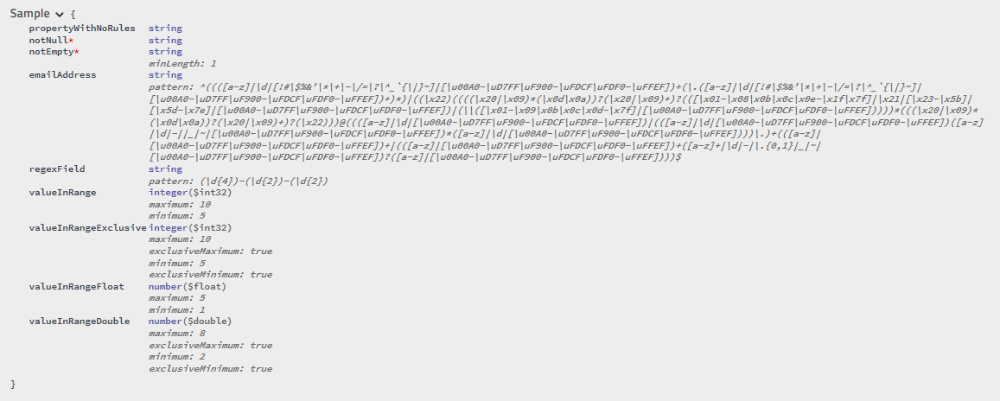

# ZymLabs.NSwag.FluentValidation

Use FluentValidation rules instead of ComponentModel attributes to define swagger schema.

## Statuses

[](https://raw.githubusercontent.com/zymlabs/nswag-fluentvalidation/master/LICENSE)
[](https://circleci.com/gh/zymlabs/nswag-fluentvalidation)

## Usage

### 1. Reference packages in your web project:

```console
dotnet add package ZymLabs.NSwag.FluentValidation
```

### 2. Change Startup.cs

```csharp
// This method gets called by the runtime. Use this method to add services to the container.
public void ConfigureServices(IServiceCollection services)
{
    services.AddOpenApiDocument((settings, serviceProvider)) =>
    {
        var fluentValidationSchemaProcessor = serviceProvider.GetService<FluentValidationSchemaProcessor>();

        // Add the fluent validations schema processor
        settings.SchemaProcessors.Add(fluentValidationSchemaProcessor);
    });

    // Add the FluentValidationSchemaProcessor as a singleton
    services.AddSingleton<FluentValidationSchemaProcessor>();
}
```

## Supported validators

* INotNullValidator (NotNull)
* INotEmptyValidator (NotEmpty)
* ILengthValidator (Length, MinimumLength, MaximumLength, ExactLength)
* IRegularExpressionValidator (Email, Matches)
* IComparisonValidator (GreaterThan, GreaterThanOrEqual, LessThan, LessThanOrEqual)
* IBetweenValidator (InclusiveBetween, ExclusiveBetween)

## Extensibility

You can register FluentValidationRule in ServiceCollection.

User defined rule name replaces default rule with the same.
Full list of default rules can be get by `FluentValidationRules.CreateDefaultRules()`

List or default rules:

* Required
* NotEmpty
* Length
* Pattern
* Comparison
* Between

Example of rule:

```csharp
new FluentValidationRule("Pattern")
{
    Matches = propertyValidator => propertyValidator is IRegularExpressionValidator,
    Apply = context =>
    {
        var regularExpressionValidator = (IRegularExpressionValidator)context.PropertyValidator;
        context.Schema.Properties[context.PropertyKey].Pattern = regularExpressionValidator.Expression;
    }
},
```

## Samples

### Swagger Sample model and validator

```csharp
public class Sample
{
    public string PropertyWithNoRules { get; set; }

    public string NotNull { get; set; }
    public string NotEmpty { get; set; }
    public string EmailAddress { get; set; }
    public string RegexField { get; set; }

    public int ValueInRange { get; set; }
    public int ValueInRangeExclusive { get; set; }

    public float ValueInRangeFloat { get; set; }
    public double ValueInRangeDouble { get; set; }
}

public class SampleValidator : AbstractValidator<Sample>
{
    public SampleValidator()
    {
        RuleFor(sample => sample.NotNull).NotNull();
        RuleFor(sample => sample.NotEmpty).NotEmpty();
        RuleFor(sample => sample.EmailAddress).EmailAddress();
        RuleFor(sample => sample.RegexField).Matches(@"(\d{4})-(\d{2})-(\d{2})");

        RuleFor(sample => sample.ValueInRange).GreaterThanOrEqualTo(5).LessThanOrEqualTo(10);
        RuleFor(sample => sample.ValueInRangeExclusive).GreaterThan(5).LessThan(10);

        RuleFor(sample => sample.ValueInRangeFloat).InclusiveBetween(1.1f, 5.3f);
        RuleFor(sample => sample.ValueInRangeDouble).ExclusiveBetween(2.2, 7.5f);
    }
}
```

### Swagger Sample model screenshot



### Validator with Include

```csharp
public class CustomerValidator : AbstractValidator<Customer>
{
    public CustomerValidator()
    {
        RuleFor(customer => customer.Surname).NotEmpty();
        RuleFor(customer => customer.Forename).NotEmpty().WithMessage("Please specify a first name");

        Include(new CustomerAddressValidator());
    }
}

internal class CustomerAddressValidator : AbstractValidator<Customer>
{
    public CustomerAddressValidator()
    {
        RuleFor(customer => customer.Address).Length(20, 250);
    }
}
```

## Credits

This project is a port of [MicroElements.Swashbuckle.FluentValidation](https://github.com/micro-elements/MicroElements.Swashbuckle.FluentValidation) to NSwag.
The initial version of this project was based on
[Mujahid Daud Khan](https://stackoverflow.com/users/1735196/mujahid-daud-khan) answer on StackOverflow:
https://stackoverflow.com/questions/44638195/fluent-validation-with-swagger-in-asp-net-core/49477995#49477995